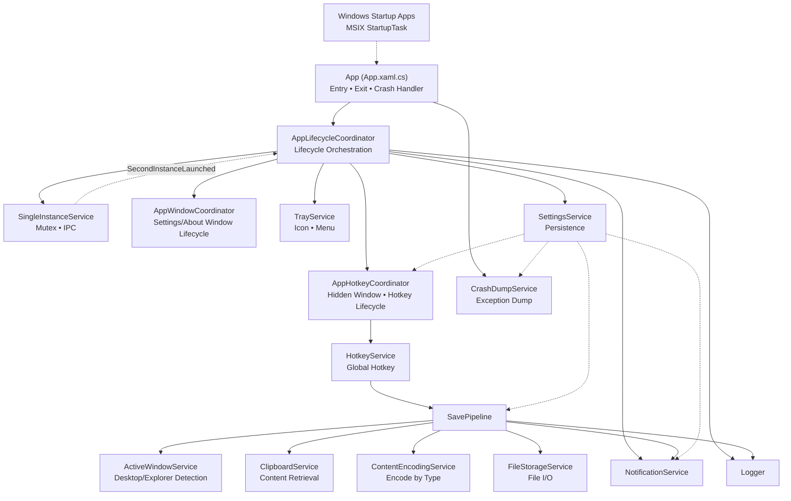
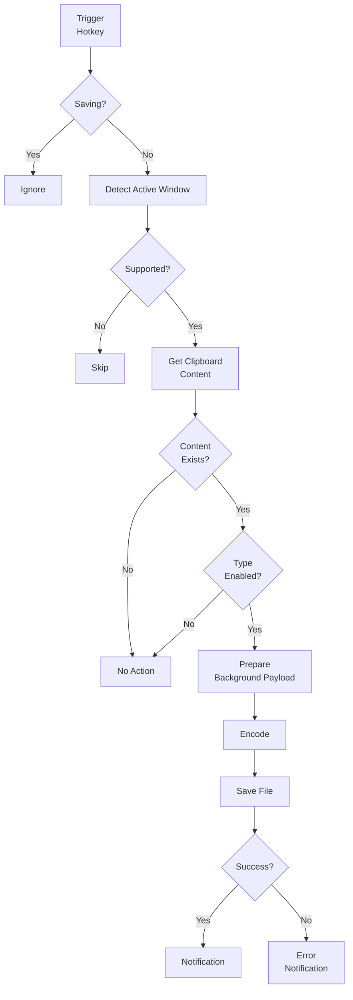
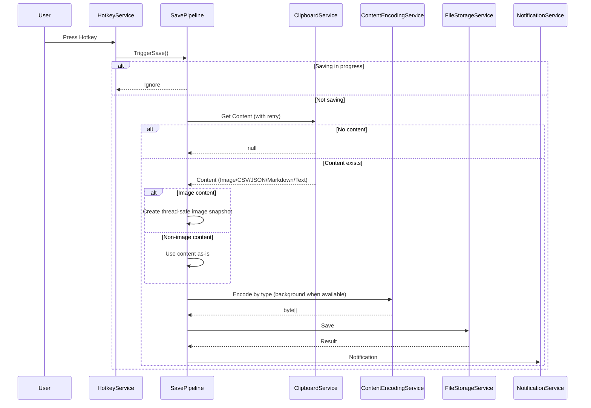
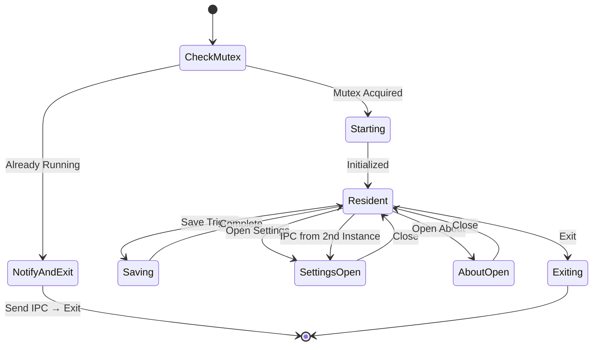

# アーキテクチャ

**このドキュメントの目的**: ClipSave のシステムアーキテクチャ、コンポーネント構成、処理フローを定義します。

製品の概要・設計思想については [製品コンセプト](../ProductConcept.md) を参照してください。

## 制約と前提

| 項目 | 制約 |
|------|------|
| 対応 OS | Windows 11 |
| ネットワーク | 通信なし（テレメトリ含む） |
| 常駐モデル | イベント駆動（ポーリング禁止） |
| クリップボード | ロックされ得る（リトライ必須）、STA 前提 |

## 技術スタック

- **Runtime**: .NET 10
- **UI Framework**: WPF
- **Architecture**: MVVM
- **Platform Target**: AnyCPU
- **Tray Icon**: NotifyIcon
- **Hotkey**: Win32 RegisterHotKey
- **Settings**: JSON
- **Startup**: MSIX StartupTask（Windows スタートアップ設定）
- **Distribution**: MSIX

## コンポーネント構成

### コンポーネント図



### コンポーネント責務

- **App (App.xaml.cs)**: アプリのエントリーポイント、起動/終了フック、クラッシュハンドリング
- **AppLifecycleCoordinator**: 起動・常駐・終了のライフサイクル調停、サービス解決、イベント購読
- **AppHotkeyCoordinator**: 不可視ウィンドウ生成、ホットキー登録/解除/復旧の協調
- **AppWindowCoordinator**: Settings/About ウィンドウの生成・再表示・クローズ時処理
- **AppServiceProviderFactory**: 起動時の DI / ロギング構成の構築（`Infrastructure/Startup`）
- **HotkeyWindowFactory**: ホットキー受信用の不可視ウィンドウ生成（`Infrastructure/Startup`）
- **SingleInstanceService**: 多重起動防止（Mutex）、二重起動時のプロセス間通信（Named Pipe）
- **TrayService**: トレイアイコン、メニュー（設定 / スタートアップ設定 / 通知設定 / バージョン情報 / 終了）
- **HotkeyService**: グローバルホットキーの登録・解除・イベント
- **SavePipeline**: 保存処理のオーケストレーション、排他制御
- **ActiveWindowService**: アクティブウィンドウ判定、保存先フォルダ決定
- **ClipboardService**: クリップボードからコンテンツ取得、種別判別、リトライ
- **ContentEncodingService**: コンテンツ種別に応じたエンコード処理
- **ImageEncodingService**: PNG/JPG エンコード、透過処理
- **FileStorageService**: ファイル保存、重複対応、原子的書き込み
- **SettingsService**: 設定の読み書き、検証、変更通知（`startupGuidanceShown` などの内部フラグを含む）
- **LocalizationService**: UI 言語の解決、リソース文字列の提供、言語変更通知、設定画面表示時の言語再適用
- **NotificationService**: バルーン通知（通知種別設定により表示）、ログ出力
- **CrashDumpService**: 未処理例外のダンプファイル生成
- **AppDataPaths**: 実行形態（MSIX/非パッケージ）に応じたアプリデータ保存先の解決
- **Logger**: デバッグログ出力（オプション）

### 実装フォルダ構成

- `Infrastructure/Startup`: 起動時の DI 構築、ライフサイクルオーケストレーション、ウィンドウ/ホットキー協調、ホットキー受信用ウィンドウ生成
- `ViewModels/About`, `ViewModels/Settings`: 画面機能単位の ViewModel
- `Views/About`, `Views/Settings`: 画面機能単位の WPF ビュー
- `Services/Encoding`: コンテンツ/画像エンコード、区切り文字テキスト変換
- `Services/Platform`: OS 連携（クリップボード、ホットキー、トレイ、単一起動、アクティブウィンドウ）
- `Services/Persistence`: 設定・ファイル保存・クラッシュダンプなど永続化
- `Services/Pipeline`: 保存オーケストレーション（`SavePipeline`）
- `Services/Notifications`: 通知配信（`NotificationService`）

## 処理フロー

### 保存フロー



### シーケンス図



### 状態図



## スレッドモデル

### WPF アプリケーションスレッド

ClipSave は WPF アプリケーションとして実装されており、以下のスレッドモデルに従います。

#### メインスレッド（UI スレッド）
- **アパートメント**: STA (Single-Threaded Apartment) 必須
- **責務**: UI 操作、メッセージループ、イベント処理
- **実行内容**:
  - `TrayService`: NotifyIcon の操作、コンテキストメニュー表示
  - `HotkeyService`: WM_HOTKEY メッセージの受信、RegisterHotKey API 呼び出し
  - `ClipboardService`: Clipboard API の呼び出し（STA 必須要件）
  - `ActiveWindowService`: Shell COM を用いたエクスプローラーパス取得
  - `SavePipeline`: 画像をバックグラウンド処理可能な `BitmapSource` にデタッチ（`CopyPixels`）
  - `SettingsWindow`: XAML ビューの表示、データバインディング

#### バックグラウンドスレッド
- **責務**: 非同期 I/O 処理、プロセス間通信
- **主な実行内容**:
  - `ContentEncodingService`: 画像スナップショットのエンコード処理（画像経路）
  - `FileStorageService.SaveFileAsync()`: ファイル書き込み処理
  - `SingleInstanceService`: Named Pipe サーバー（二重起動検出用）
  - ディスク容量チェック（保存直前）

※ 非画像コンテンツのエンコードは呼び出しコンテキストで実行される場合がある

#### UI スレッドとの同期
- **同期方式**: `SynchronizationContext` による UI スレッドへの投稿（バルーン通知表示時）

#### 並行制御
- **保存処理の排他制御**: `SemaphoreSlim` によるロック
  - 保存処理中の追加トリガーは無視（キューイングなし）
- **クリップボードアクセス**: リトライ機構でロック解決を試行（詳細は `SPEC-030-003`）

## データフロー

**設定データフロー**
```
settings.json ──Load──▶ SettingsService ──Notify──▶ Services
                              ▲
                              │
                         Save (After validation)
                              │
                        SettingsWindow
```
※ 自動起動の ON/OFF は `settings.json` ではなく Windows のスタートアップ設定で管理
※ 通知全体の ON/OFF は `settings.json` ではなく Windows の通知設定で管理

**自動起動データフロー**
```
Package.appxmanifest(StartupTask) ──Register──▶ Windows Startup Apps ──Launch──▶ App (App.xaml.cs) ──Init──▶ AppLifecycleCoordinator
```
※ `Package.appxmanifest` の `startupTask` `Executable` は `ClipSave\ClipSave.exe` を確認

**画像データフロー**
```
Clipboard ──Get(STA)──▶ BitmapSource(UI ownership)
  ──Detach(CopyPixels + Freeze)──▶ BitmapSource(Thread-safe)
  ──Encode──▶ byte[] ──Save──▶ File
```

## 終了フロー

- トレイメニュー「終了」→ `ExitRequested` → `Shutdown()` → `OnExit()`
- `OnExit()` で `AppLifecycleCoordinator.Dispose()` → `ServiceProvider.Dispose()` の順に破棄
- `AppLifecycleCoordinator.Dispose()` でイベント購読解除、ウィンドウクローズ、ホットキー解除を実行
- 各サービスは Win32 リソース（ホットキー、ミューテックス等）を解放

## エラー処理戦略

- コンテンツなし: ログに記録、通知種別設定に応じてバルーン通知
- クリップボード失敗: リトライ、その後通知種別設定に応じてバルーン通知とログ
- I/O 失敗: 通知種別設定に応じてバルーン通知とログでユーザーに通知
- 対象外ウィンドウ: 保存をスキップ（通知なし）
- 設定ファイル破損: 既定値で起動、通知種別設定に応じてバルーン通知とログで通知
- 予期しない例外（終了を伴う場合）: ダンプファイル出力、ログ記録、終了時はダイアログ表示

例外境界やログ・コメントの書き方は [コーディングガイドライン](CodingGuidelines.md) を参照。

## セキュリティとプライバシー

- ネットワーク送信なし
- 画像内容の解析・保持なし
- 設定・ログはローカルのみ

## 関連ドキュメント

- [使い方ガイド](../UsageGuide.md) - 基本操作と設定
- [仕様](Specification.md) - 詳細仕様（SPEC-ID）
- [コーディングガイドライン](CodingGuidelines.md) - コメント・ログ・例外の規約
- [バージョニング](../ops/Versioning.md) - バージョン管理規約
