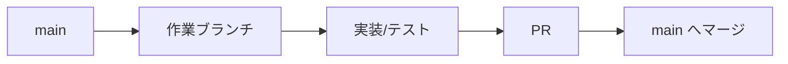
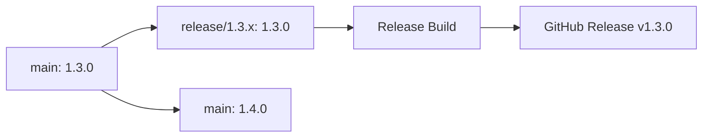

# ブランチ戦略

ClipSave のブランチ運用ルールを定義します。

## 運用ルール

1. 日常開発は `main` を基点に短命ブランチで行う。
2. リリース時に `release/X.Y.x` を作成する。
3. リリース後の修正は `main` に先に入れ、必要分だけ `release` にチェリーピックする。
4. リリース版のビルドは `release/*` ブランチでのみ行う。
5. `release` から `main` へ直接マージしない。

## ブランチモデル

| ブランチ | 用途 | 作成タイミング | 期限 |
|---------|------|----------------|------|
| `main` | 開発トランク | 常設 | 永続 |
| `release/X.Y.x` | リリース系列の保守 | メジャー/マイナーリリース時 | サポート終了まで |

## 基本開発フロー

1. `main` から作業ブランチを作成
2. 実装・テスト
3. PR を作成
4. レビュー後 `main` へマージ



## メジャー/マイナーリリース

### 実行コマンド

```powershell
.\scripts\create-release-branch.ps1 -Version 1.3.0
```

オプション例:
```powershell
.\scripts\create-release-branch.ps1 -Version 1.3.0 -SkipPull
.\scripts\create-release-branch.ps1 -Version 1.3.0 -MainBranch main -Push
```

### スクリプトが行うこと

- `release/1.3.x` を作成
- `release/1.3.x` のバージョンを `1.3.0` に設定
- `main` のバージョンを `1.4.0` に更新
- `main` の `Package.appxmanifest` を `1.4.0.0` に更新
- 誤操作防止として、`main` の現在版数系列（`X.Y`）と `-Version` の系列が一致しない場合は中断



## パッチリリース

1. `main` で不具合修正をマージ
2. `release/X.Y.x` に対象コミットをチェリーピック
3. `Directory.Build.props` を `X.Y.Z` に更新
4. `Package.appxmanifest` を `X.Y.Z.0` に更新
5. `release/X.Y.x` に push して Release Build を実行

```powershell
git checkout release/1.3.x
git cherry-pick <commit-hash>
# バージョン更新
# Directory.Build.props: 1.3.1
# Package.appxmanifest: 1.3.1.0
git commit -am "chore: bump version to 1.3.1"
git push origin release/1.3.x
```

## 運用ガードレール

### Do

- `main` を常にマージ可能・リリース可能な状態に保つ
- 修正はまず `main` に入れる
- リリース系列ごとに `release/X.Y.x` を分ける

### Don't

- `release` ブランチで新機能開発しない
- `release` から `main` へ直接マージしない
- パッチ対応のたびに新しい `hotfix/*` ブランチ運用を復活させない

## 関連ドキュメント

- [Versioning](Versioning.md)
- [Deployment](Deployment.md)
