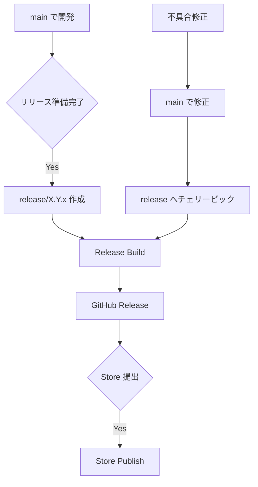

# デプロイ

ClipSave の CI/CD と配布手順を定義します。

## 全体フロー



## ワークフロー一覧

| ワークフロー | トリガー | 主な用途 | 生成物 |
|-------------|---------|---------|--------|
| [pr-check.yml](../../.github/workflows/pr-check.yml) | PR (`main`, `release/*`) | ビルド・テスト・セキュリティチェック・SPEC整合・版数整合チェック | `TestResults/**/*.trx`（artifact） |
| [dev-build.yml](../../.github/workflows/dev-build.yml) | `main` への push / 手動 | 開発版配布（`docs/**` と `*.md` のみ変更時は自動起動しない） | `output/**/*.msix` |
| [release-build.yml](../../.github/workflows/release-build.yml) | `release/*` への push / 手動 | 公開版配布（GitHub Release） | `output/**/*.msix` |
| [store-publish.yml](../../.github/workflows/store-publish.yml) | 手動実行（`X.Y.Z` 指定） | Store 提出パッケージ生成 | `StorePackage/**/*.msixupload` |

注意:
- Store 提出には `.msixupload` が必要（`.msix` は提出不可）。
- 日常開発は `main`、リリース系列保守は `release/X.Y.x`。

## MSIX 署名方針

- CI（`dev-build.yml` / `release-build.yml` / `store-publish.yml`）と `scripts/build-store-package.ps1` は、`/p:AppxPackageSigningEnabled=false` でビルドする。
- 本リポジトリでは、署名証明書（PFX）や秘密情報を保管しない。
- Store 配布は `.msixupload` を Partner Center に提出し、配布チャネル側の署名・配布フローに委ねる。

## 各ワークフローの要点

### セキュリティチェック（共通）

すべてのビルド系ワークフローと `build-store-package.ps1` で `run-security-checks.ps1` を実行する。

| チェック項目 | 内容 | 検出時の扱い |
|-------------|------|-------------|
| 依存脆弱性スキャン | `dotnet list package --vulnerable --include-transitive` | ビルド失敗 |
| 静的セキュリティ分析 | Roslyn Security Analyzer（`AnalysisModeSecurity=All`） | 警告をエラー扱い |

Action の固定方針:
- GitHub 公式 action: メジャータグ（例: `@v4`）
- サードパーティ action: フル SHA で固定

### PR Check

- `dotnet restore/build/test` を実行
- `LocalizationResourceCompletenessTests` を先行実行し、翻訳リソース欠落を早期検出
- `run-tests.ps1` の TRX を artifact に保存し、失敗時のログ調査を容易にする
- `check-spec-coverage.ps1` で仕様 ID とテスト `Spec` 属性の整合性を検証
- `validate-version.ps1 -BranchName <base branch>` で整合性検証

### Dev Build (`main`)

- 実行ブランチが `main` でない場合は失敗（手動実行時の誤配布防止）
- `validate-version.ps1 -BranchName <実行ブランチ>` を実行
- `Directory.Build.props` からコア版 `X.Y.Z` を抽出
- `X.Y.Z.<GITHUB_RUN_NUMBER>` で MSIX を生成
- `dev-latest` prerelease を更新
- バージョンファイルはコミットしない

### Release Build (`release/*`)

- 実行ブランチが `release/X.Y.x` 形式でない場合は失敗（手動実行時の誤リリース防止）
- `validate-version.ps1 -BranchName release/X.Y.x` を実行
- `Package.appxmanifest` の `X.Y.Z.0` で公開版をビルド
- `vX.Y.Z` タグの GitHub Release を作成

### Store Publish（手動）

- 入力した `X.Y.Z` から `release/X.Y.x` を解決
- 対象ブランチ存在を検証
- `.msixupload` を生成して Artifact に保存

## 実運用手順

### メジャー/マイナーリリース

1. `main` が安定したら以下を実行

```powershell
.\scripts\create-release-branch.ps1 -Version 1.3.0
```

2. `release/1.3.x` を push
3. Release Build 実行
4. GitHub Release を確認

### パッチリリース

1. `main` で修正してマージ
2. `release/X.Y.x` にチェリーピック
3. バージョン更新
4. `release/X.Y.x` に push
5. Release Build 実行

```powershell
git checkout release/1.3.x
git cherry-pick <commit-hash>
# Directory.Build.props: 1.3.1
# Package.appxmanifest: 1.3.1.0
git commit -am "chore: bump version to 1.3.1"
git push origin release/1.3.x
```

### Store 提出

1. 展開前チェック

```powershell
.\scripts\store-checklist.ps1
```

2. Store パッケージ作成
- GitHub Actions: `Store Publish` を手動実行
- ローカル: `.\scripts\build-store-package.ps1`

3. Partner Center で `.msixupload` を提出

## 補足

### なぜ Store は手動運用か

| 理由 | 内容 |
|------|------|
| 審査プロセス | Microsoft 側審査が必要 |
| メタデータ更新 | 説明文・画像は人手更新が必要 |
| リスク管理 | 段階的リリース判断が必要 |

### 便利コマンド

```powershell
.\scripts\check-version.ps1
.\scripts\run-tests.ps1 -Configuration Release
.\scripts\run-security-checks.ps1 -Configuration Release
.\scripts\measure-build-success.ps1 -Workflow "Dev Build"
.\scripts\measure-downloads.ps1 -IncludePrerelease:$true
```

## 関連ドキュメント

- [BranchStrategy](BranchStrategy.md)
- [IconAssets](IconAssets.md)
- [Versioning](Versioning.md)
- [RELEASE_NOTES](../../RELEASE_NOTES.md)
