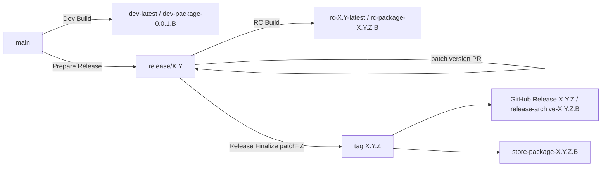

# リリースプロセス

**このドキュメントの目的**: ClipSave のリリース系列、版数、タグ、配布チャネル、`Release Finalize`、Store 公開の関係を定義します。
`docs/release` 領域の正本はこのドキュメントとし、実行手順は [Release Guide](ReleaseGuide.md)、GitHub Release Notes の運用は [ReleaseNotes](ReleaseNotes.md) に分離します。

## このドキュメントの役割

- `main` / `release/X.Y` / version tag `X.Y.Z` の関係を定義する
- ブランチ種別、統合方向、版数とタグのルールをまとめる
- Dev / RC / Archive / Store の各チャネルの位置づけを揃える
- latest-only 運用とサポート終了の判定基準を明文化する
- `Release Finalize` と Store 公開の関係、Store への handoff 条件を整理する

このドキュメントでは、workflow の実行手順、Partner Center 入力手順、GitHub Release Notes の具体運用までは扱いません。

## 全体像

| 要素 | 役割 | 正本 |
| ---- | ---- | ---- |
| `main` | 次期開発の幹 | このドキュメント |
| `release/X.Y` | 安定化と現行系列サポート | このドキュメント |
| `dev-latest` | `main` の最新検証成果物 | このドキュメント / [Release Guide](ReleaseGuide.md) |
| `rc-X.Y-latest` | `release/X.Y` の最新候補 | このドキュメント / [Release Guide](ReleaseGuide.md) |
| version tag `X.Y.Z` | patch line を指す version tag | このドキュメント |
| GitHub Release `X.Y.Z` | patch line 向けの archive / notes 参照 | [Release Guide](ReleaseGuide.md) / [ReleaseNotes](ReleaseNotes.md) |
| Store package | 一般ユーザー向け公開物 | [Release Guide](ReleaseGuide.md) / [Store Submission](../distribution/store/StoreSubmission.md) |

## 基本モデル

1. 開発の正本は常に `main` とする。
2. `main` の repository version は固定で `0.0.1` とし、release 準備のたびに version bump しない。
3. `release/X.Y` の repository version は `X.Y.Z` とし、`PATCH` がその系列の公開順序を表す。
4. 配布物の package / file version は 4 桁とし、4 桁目 `B` を build 番号として使う。
5. Dev の配布版は MSIX 都合のため予約済み preview line `0.0.1.B` を使う。
6. RC / Archive / Store の配布版は `X.Y.Z.B` を使い、`B` は `release/X.Y` ごとの `rc-build` カウンターを採用する。
7. `release/X.Y` を新しく作ると、その branch の `B` は 1 から数え直す。
8. `B=0` は配布版として使わない。`.0` を確定版にする運用はやめる。
9. version tag は引き続き `X.Y.Z` とし、GitHub Release `X.Y.Z` は patch line を表す。
10. `Release Finalize` は branch 上の現在値を暗黙採用するのではなく、選択した `release/X.Y` と手動入力の `patch=Z` から `version=X.Y.Z` を解決し、`rc-X.Y-latest` の最新成功候補から `build=B` を自動採用して archive / Store package を揃える。
11. `Prepare Release` による main bump PR と、patch 開始専用 workflow は廃止する。

## ブランチモデル

### ブランチ種別

| ブランチ | 寿命 | 用途 |
| ---- | ---- | ---- |
| `main` | 永続 | 次期開発の幹 |
| `release/X.Y` | 中長期 | 公開安定化、現行系列サポート |
| `feature/*` | 短命 | 機能追加 |
| `fix/*` | 短命 | 不具合修正、backport |
| `docs/*` | 短命 | ドキュメント更新 |
| `chore/*` | 短命 | 運用、自動化、雑務 |

### 命名ルール

- 長寿命ブランチは `main` と `release/X.Y` のみとする。
- 作業ブランチのプレフィックスは `feature/`, `fix/`, `docs/`, `chore/` のみ許可する。
- `release/X.Y.Z` や `hotfix/*` のようなパッチ単位ブランチは作成しない。

### 統合ルール

1. 作業ブランチは `main` または対象 `release/X.Y` から作成し、PR で統合する。
2. 修正の正本は常に `main` とし、release 側は必要分のみ backport する。
3. `release/X.Y` から `main` へマージしない。
4. `main` / `release/X.Y` への直 push は行わない。
5. 緊急修正も `hotfix/*` ではなく、通常の patch release 手順で扱う。

### backport 競合解消方針

1. `release/X.Y` から backport 用ブランチ（例: `fix/release-X.Y-backport-<id>`）を作成する。
2. `cherry-pick` の競合は release 系列の互換性を優先して解消する。
3. 競合解消内容と理由を PR に明記する。
4. release 側だけの場当たり修正を避け、必要なら `main` に先行調整を入れてから再 backport する。

### GitHub での強制

- `main` / `release/*` は Branch protection または Ruleset で保護する。
- ブランチ命名と保護の定義は `.github/rulesets/` を正本とし、GitHub 側で変更したら同時に更新する。
- PR レビュー運用は [../../.github/CODEOWNERS](../../.github/CODEOWNERS) を基準にし、現行ルールでは Code Owner のレビューを必須とする。

## 系列ライフサイクル

### 1. Prepare

- `main` から `release/X.Y` を作成する。
- `release/X.Y` 側だけを対象系列の `X.Y.Z` へ進める。
- `main` は `0.0.1` のまま維持する。release 準備で main bump PR は作らない。

### 2. Stabilize

- `release/X.Y` では新機能開発を行わず、安定化と必要な修正だけを扱う。
- 候補比較には `rc-X.Y-latest` と RC 成果物を使う。
- RC の package version は `X.Y.Z.B` とし、`B` は同じ `release/X.Y` branch の中で build ごとに増える。
- 新しい `release/X.Y` を切ると、その branch の `B` は 1 から始まる。

### 3. Finalize

- 確定対象は、その時点の現行サポート patch line と、その patch line に対する最新成功 RC build `X.Y.Z.B` の組で決める。
- `Release Finalize` は選択した `release/X.Y` と手動入力の `patch=Z` から `version` を解決し、Store 提出前は `rc-X.Y-latest` の最新成功候補を採用して tag / archive / Store package を揃える。
- 4 桁目 `B=0` は無効とし、配布版には使わない。
- Store 提出前の手動再実行では、同じ patch line に対して `patch=Z` を指定し、その時点の最新成功 RC 候補を採用して archive / Store package を差し替えてよい。
- Store 提出記録後は、その patch line の採用 commit を固定とする。

### 4. Distribute

- Archive: GitHub Release `X.Y.Z` に、採用した最新成功 RC build の archive（`X.Y.Z.B`）を保持する。
- Store: 一般ユーザー向けに出す版だけ、`Release Finalize` から Store package を生成する。
- Store 公開の有無は finalized 判定に影響させないが、採用 commit 固定の境界は `Store Submission Log` 記録時点とする。

### 5. Support

- ClipSave は latest-only 運用とし、能動サポート対象は常に最新 finalized 系列 1 つのみとする。
- 現行系列である間だけ、patch release、Store 再提出、`Release Finalize` 実行 / 再実行を通常運用として行う。
- PR / RC を workflow で一律停止しない。hard gate は Store package 生成時だけに置く。

### 6. End of support

- 新しい系列 `release/A.B` の最初の finalize が完了した時点で、旧系列 `release/X.Y` は `frozen / unsupported` へ移る。
- 旧系列は remote に残すが、通常の patch、RC 更新、`Release Finalize`、Store 再提出は行わない。
- 旧系列の既存 tag / GitHub Release は履歴として保持し、採用 build の差し替えには使わない。

## latest-only の判断基準

- 切替基準は Store 公開有無ではなく Finalize 完了とする。
- 新系列を archive-only で Finalize した場合でも、その時点で旧系列はサポート対象から外れる。
- `Release Finalize` の実行対象も、現行サポート系列の current patch line のみに限定する。
- 同一系列内でも Store package mode を許可するのは、最新 finalized patch line のみとする。

## Store チャネルへの進行条件

1. Store 提出へ進めるのは、repository 全体の最新 finalized patch line で、かつ一般ユーザー向けに出す版のみとする。
2. 対象の patch line は version tag `X.Y.Z` を正本とし、実際の package version は `X.Y.Z.B` とする。
3. Store package の生成は `Release Finalize` から行う。
4. Partner Center へ提出したら GitHub Release 本文の `Store Submission Log` に submission ID と commit を記録し、その時点で採用 commit を固定する。
5. `store-package-*` を取得できた時点で、release 側の handoff 自体は完了としてよい。

## 版数とタグ

### SemVer

| 要素 | 意味 | 例 |
| ---- | ---- | ---- |
| `MAJOR` | 破壊的変更 | `1.9.5` → `2.0.0` |
| `MINOR` | 後方互換な機能追加 | `1.0.1` → `1.1.0` |
| `PATCH` | 後方互換な不具合修正 | `1.0.0` → `1.0.1` |
| `BUILD` | 同一 patch line 内の配布 build | `1.0.1.12` → `1.0.1.13` |

### repository version と配布 version

| 文脈 | repository 上の版数 | 配布時の package / file version | 用途 |
| ---- | ---- | ---- | ---- |
| `main` | `0.0.1` | `0.0.1.B` | Dev preview line |
| `release/X.Y` | `X.Y.Z` | `X.Y.Z.B` | RC / Archive / Store |

補足:

- `Directory.Build.props` の `Version` は repository 上では常に 3 桁とする。
- `Package.appxmanifest` は repository 上では `Version.0` を保持する。
- Dev / RC / Archive / Store の 4 桁目 `B` は CI / finalize 時に注入し、repository にはコミットしない。
- `B` は正の整数とし、配布 build に `0` は使わない。
- RC の `B` は branch ごとのカウンターであり、`release/0.1` と `release/0.2` では独立して数える。

なぜこの運用にするか:

- `main` を `0.0.1` に固定するのは、Dev を常に preview line として識別し、安定化対象の `release/X.Y` が持つ `X.Y.Z` と混同しないため。
- Dev を `0.0.1.B`、RC / Archive / Store を `X.Y.Z.B` に分けるのは、Preview チャネルと release-line 候補を version line だけで見分けられるようにし、patch line ごとの採用判断を単純化するため。
- `AssemblyVersion` は CLR の互換性軸として固定寄りに扱い、配布 build の識別責務は `FileVersion` / package version / `InformationalVersion` に寄せる。Dev で `0.0.0.0`、release 系で `X.Y.0.0` を使うのはこのため。

### タグ種別

| 種別 | 形式 | 更新可否 | 用途 |
| ---- | ---- | ---- | ---- |
| Dev チャネルタグ | `dev-latest` | 可（移動） | `main` の最新検証成果物 |
| RC チャネルタグ | `rc-X.Y-latest` | 可（移動） | `release/X.Y` の最新候補 |
| version tag | `X.Y.Z` | patch line ごとに固定 | finalize / archive / store の基準 |

補足:

- `dev-latest` / `rc-X.Y-latest` は floating tag として、docs-only を含む対象 branch の最新 commit へ追随させる。

### 判定ルール

| 場面 | 判定情報 | ルール |
| ---- | ---- | ---- |
| Dev 配布物 | package / file version | `0.0.1.B` を使う |
| RC / Archive / Store 配布物 | package / file version | `X.Y.Z.B` を使う |
| 配布 build の有効性 | 4 桁目 `B` | `B > 0` 必須 |
| 配布物 | 配布チャネル | `rc-X.Y-latest` は最新候補、GitHub Release `X.Y.Z` は patch line 用の archive 窓口 |

### 検証ルール

`assert-version-policy.ps1` では repository 上の version files を検証する。

1. `Directory.Build.props` が `X.Y.Z` 形式
2. `Package.appxmanifest` が `X.Y.Z.0` 形式
3. 両者の `X.Y.Z` が一致
4. `release/X.Y` ではブランチ名と版数の `X.Y` が一致

補足:

- `main` の `0.0.1` もこのルールに含める。
- Dev / RC / Archive / Store で注入する build 番号は、この検証対象外とする。

## 版数更新ルール

### 共通

- 版数更新は作業ブランチから PR で反映する。
- `main` / `release/X.Y` への直 push は行わない。
- `Prepare Release` による初期作成コミットだけを例外とする。

### メジャー / マイナー開始

- `Prepare Release` は explicit な `X.Y` を入力として `release/X.Y` を作成する。
- `release/X.Y` 作成後も `main` は `0.0.1` のまま維持する。
- main を次系列へ進めるための bump PR は作らない。

### パッチリリース

- patch release は現行サポート系列でのみ行う。
- 前回の patch line が `X.Y.Z` なら、次回は `X.Y.(Z+1)` とする。
- `PATCH` を上げるのは `release/X.Y` 向けの通常 PR とし、専用の patch init workflow は使わない。
- `PATCH` 更新 PR がマージされた後、RC Build が `X.Y.(Z+1).B` を発行する。
- `B` はその `release/X.Y` branch で継続し、新しい release branch を切るとリセットされる。
- finalize では、その時点の `release/X.Y` が持つ patch line に対して、`rc-X.Y-latest` の最新成功候補を自動採用する。

### Dev Build

- `main` の Dev Build は repository version `0.0.1` を保持したまま、配布時だけ `0.0.1.B` を注入する。
- Dev build のために repository 上の版数ファイルは変更しない。

## Unsigned Channel Identity ポリシー

Dev / RC / Archive は Store 版と別の unsigned 用 Identity（`Identity Name` / `Publisher`）を採用する。

- unsigned 用 Identity は `ClipSave.Preview` とし、Publisher には Unsigned marker を含める。詳細な manifest 値は `scripts/set-package-manifest.ps1` を正本とする。
- Store 提出物は従来どおり `tnagata012.ClipSave` / `CN=6ECD54B7-8ED5-46BA-81AD-ECBC0E843959` を使う。
- Dev は `0.0.1.B`、RC / Archive は `X.Y.Z.B` を使うため、channel をまたぐ切り替えでは上書き導入できないことがある。
- RC 候補から同じ build を採用した Archive へ切り替える場合は、同一 package version のためアンインストールが必要になることがある。

## 文書の責務分担

| 文書 | 何を正本にするか |
| ---- | ---- |
| [ReleaseGuide](ReleaseGuide.md) | workflow、成果物、リリース実行ガイド |
| [ReleaseNotes](ReleaseNotes.md) | `Release Notes: Unreleased` / `Release Notes: X.Y` / GitHub Release 参照の運用ルール |
| [../distribution/Signing](../distribution/Signing.md) | 署名方針と配布安全性 |
| [../distribution/store/StoreSubmission](../distribution/store/StoreSubmission.md) | Partner Center 提出、listing 運用、提出記録 |
| [../distribution/ArtifactInstallation](../distribution/ArtifactInstallation.md) | 未署名アーティファクトの検証・導入手順 |

## 関連ドキュメント

- [ReleaseGuide](ReleaseGuide.md)
- [ReleaseNotes](ReleaseNotes.md)
- [../distribution/Signing.md](../distribution/Signing.md)
- [../distribution/ArtifactInstallation.md](../distribution/ArtifactInstallation.md)
- [../distribution/store/StoreSubmission.md](../distribution/store/StoreSubmission.md)
