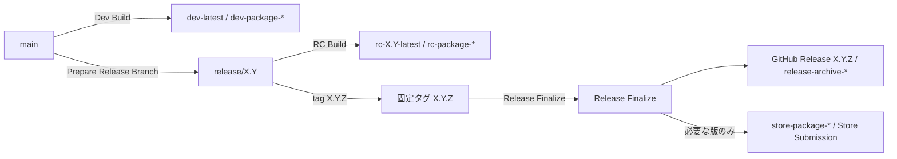

# リリースプロセス

ClipSave のリリース系列、版数、タグ、配布チャネル、`Release Finalize`、Store 公開の関係を定義します。
`docs/release` 領域の正本はこの文書とし、実行手順は [Release Guide](ReleaseGuide.md)、CHANGELOG 記法は [ReleaseNotes](ReleaseNotes.md) に分離します。

## この文書の役割

- `main` / `release/X.Y` / 確定タグ `X.Y.Z` の関係を定義する
- ブランチ種別、統合方向、版数とタグのルールをまとめる
- Dev / RC / Archive / Store の各チャネルの位置づけを揃える
- latest-only 運用とサポート終了の判定基準を明文化する
- `Release Finalize` と Store 公開の関係、Store への handoff 条件を整理する

この文書では、workflow の実行手順、Partner Center 入力手順、CHANGELOG の具体的な記法までは扱いません。

## 全体像

| 要素                   | 役割                     | 正本                                                         |
| ---------------------- | ------------------------ | ------------------------------------------------------------ |
| `main`                 | 次期開発の幹             | この文書                                                     |
| `release/X.Y`          | 安定化と現行系列サポート | この文書                                                     |
| `dev-latest`           | `main` の最新検証成果物  | この文書 / [Release Guide](ReleaseGuide.md)                  |
| `rc-X.Y-latest`        | `release/X.Y` の最新候補 | この文書 / [Release Guide](ReleaseGuide.md)                  |
| `X.Y.Z`                | 確定版を指す固定タグ     | この文書                                                     |
| GitHub Release `X.Y.Z` | 確定版アーカイブの保存先 | [Release Guide](ReleaseGuide.md)                             |
| Store package          | 一般ユーザー向け公開物   | [Release Guide](ReleaseGuide.md) / [Store Submission](../distribution/store/StoreSubmission.md) |

関係だけを先に追いたい場合は、次の図を見ると把握しやすいです。

## 基本モデル

1. 開発の正本は常に `main` とする。
2. メジャー/マイナー開始時にだけ `release/X.Y` を作成し、公開品質の安定化を行う。
3. 版数の SSOT は `Directory.Build.props` の `Version` (`X.Y.Z`) とする。
4. Dev/RC は比較・検証用の移動タグであり、履歴の正本ではない。
5. 確定版は固定タグ `X.Y.Z` を付与した時点で成立する。
6. `Release Finalize` は確定タグから不変のアーカイブ成果物を GitHub Release `X.Y.Z` に保存する。
7. Store 公開は確定版の後段にある任意工程であり、確定そのものとは別工程とする。

## ブランチモデル

### ブランチ種別

| ブランチ      | 寿命   | 用途                         |
| ------------- | ------ | ---------------------------- |
| `main`        | 永続   | 次期開発の幹                 |
| `release/X.Y` | 中長期 | 公開安定化、現行系列サポート |
| `feature/*`   | 短命   | 機能追加                     |
| `fix/*`       | 短命   | 不具合修正、backport         |
| `docs/*`      | 短命   | ドキュメント更新             |
| `chore/*`     | 短命   | 運用、自動化、雑務           |

### 命名ルール

- 長寿命ブランチは `main` と `release/X.Y` のみとする。
- 作業ブランチのプレフィックスは `feature/`, `fix/`, `docs/`, `chore/` のみ許可する。
- `release/X.Y.Z` や `hotfix/*` のようなパッチ単位ブランチは作成しない。

### 統合ルール

1. 作業ブランチは `main` または対象 `release/X.Y` から作成し、PR で統合する。
2. 修正の正本は常に `main` とし、release 側は必要分のみ backport する。
3. `release/X.Y` から `main` へマージしない。
4. `main` / `release/X.Y` への直 push は行わない。
5. 緊急修正も `hotfix/*` ではなく通常のパッチリリース手順で扱う。

### backport 競合解消方針

1. `release/X.Y` から backport 用ブランチ（例: `fix/release-X.Y-backport-<id>`）を作成する。
2. `cherry-pick` の競合は release 系列の互換性を優先して解消する。
3. 競合解消内容と理由を PR に明記する。
4. release 側だけの場当たり修正を避け、必要なら `main` に先行調整を入れてから再 backport する。

### GitHub での強制

- `main` / `release/*` は Branch protection または Ruleset で保護する。
- ブランチ命名と保護の定義は `.github/rulesets/` を正本とし、GitHub 側で変更したら同時に更新する。
- PR レビュー運用は [../../.github/CODEOWNERS](../../.github/CODEOWNERS) を基準にし、現行ルールでは Code Owner のレビューを必須とする。
- 承認必須人数や自己マージ可否などの PR ルールは、リポジトリ設定と Ruleset の実態を正本とし、メンバー構成が変わった時点で見直す。

## 系列ライフサイクル

### 1. Prepare

- 安定した `main` から `release/X.Y` を作成する。
- 同時に `main` は次系列へ進める。
- この時点では旧系列がまだ現行サポート系列であってもよい。

### 2. Stabilize

- `release/X.Y` では新機能開発を行わず、安定化と必要な修正だけを扱う。
- 候補比較には `rc-X.Y-latest` と RC 成果物を使う。
- 修正は `main` を正本とし、必要なものだけ backport する。

### 3. Finalize

- 確定対象コミットを決め、固定タグ `X.Y.Z` を付与する。
- タグ push または手動実行で `Release Finalize` を実行する。
- `Release Finalize` 完了により、その系列は finalized 系列として扱う。

### 4. Distribute

- Archive: `Release Finalize` により GitHub Release `X.Y.Z` に未署名アーカイブを保存する。
- Store: 一般ユーザー向けに出す版だけ、`build_store_package=true` で Store package を生成する。
- Store 公開の有無は finalized 判定に影響させない。

### 5. Support

- ClipSave は latest-only 運用とし、能動サポート対象は常に最新 finalized 系列 1 つのみとする。
- 現行系列である間だけ、patch release、Store 再提出、`Release Finalize` 再実行を通常運用として行う。
- PR / RC / patch init を workflow で一律停止しない。hard gate は Store package 生成時だけに置く。

### 6. End of support

- 新しい系列 `release/A.B` の最初の確定タグ `A.B.Z` を Finalize した時点で、旧系列 `release/X.Y` は `frozen / unsupported` へ移る。
- 旧系列は remote に残すが、通常の patch、RC 更新、Store 再提出は行わない。
- 旧系列の既存確定タグ `X.Y.Z` に対する `Release Finalize` 再実行は、アーカイブや GitHub Release メタデータ保守に限って例外的に許容する。

## latest-only の判断基準

- 切替基準は Store 公開有無ではなく Finalize 完了とする。
- 新系列を archive-only で Finalize した場合でも、その時点で旧系列はサポート対象から外れる。
- 同一系列内でも Store package mode を許可するのは最新 finalized version のみとする。

## Store チャネルへの進行条件

Store 提出へ進める条件は release 文書側で定義し、Partner Center 実務は distribution 文書へ分離する。

1. Store 提出へ進めるのは、repository 全体の最新 finalized version で、かつ一般ユーザー向けに出す版のみとする。
2. 対象版には固定タグ `X.Y.Z` と GitHub Release `X.Y.Z` が存在し、`Release Finalize` の archive 成果物が揃っていることを前提とする。
3. Store package の生成は `Release Finalize` の `build_store_package=true` に限定する。
4. `store-package-*` を取得できた時点で、release 側の handoff は完了とする。
5. 以後の Partner Center での package upload、listing import、審査向け補足、submission ID 記録は [../distribution/store/StoreSubmission.md](../distribution/store/StoreSubmission.md) を正本とする。

## 版数とタグ

### SemVer

| 要素    | 意味                 | 例                |
| ------- | -------------------- | ----------------- |
| `MAJOR` | 破壊的変更           | `1.9.5` → `2.0.0` |
| `MINOR` | 後方互換な機能追加   | `1.0.1` → `1.1.0` |
| `PATCH` | 後方互換な不具合修正 | `1.0.0` → `1.0.1` |

### 属性マッピング

| 属性                                | 非 Dev                 | Dev                              | 用途                   |
| ----------------------------------- | ---------------------- | -------------------------------- | ---------------------- |
| `Directory.Build.props` (`Version`) | `X.Y.Z`                | `X.Y.Z`                          | SSOT                   |
| `InformationalVersion`              | `X.Y.Z+sha.<shortSha>` | `X.Y.Z-dev.<run>+sha.<shortSha>` | 追跡、判定             |
| `AssemblyVersion`                   | `X.Y.0.0`              | `X.Y.0.0`                        | バインディング互換維持 |
| `FileVersion`                       | `X.Y.Z.0`              | `X.Y.Z.<run>`                    | DLL 判定補助           |
| MSIX Version                        | `X.Y.Z.0`              | `X.Y.Z.<run>`                    | パッケージ版数         |

補足:

- `Package.appxmanifest` はリポジトリ上で `X.Y.Z.0` を保持する。
- Dev 版数の `<run>` は CI が一時注入し、版数ファイルはコミットしない。
- ローカル手動ビルドの `InformationalVersion` 既定値は `$(Version).local` とする。

### タグ種別

| 種別             | 形式            | 更新可否     | 用途                                     |
| ---------------- | --------------- | ------------ | ---------------------------------------- |
| Dev チャネルタグ | `dev-latest`    | 可（移動）   | `main` の最新検証成果物                  |
| RC チャネルタグ  | `rc-X.Y-latest` | 可（移動）   | `release/X.Y` の最新候補                 |
| 確定タグ         | `X.Y.Z`         | 不可（固定） | 確定版のコミットとアーカイブを不変で識別 |

### 判定ルール

| 場面     | 判定情報                                   | ルール                                                       |
| -------- | ------------------------------------------ | ------------------------------------------------------------ |
| CI/CD    | `InformationalVersion` + 実行ブランチ/参照 | `release/X.Y` または確定タグ `X.Y.Z` 実行で、`-dev.` を含まなければ非 Dev |
| DLL 確認 | `FileVersion`                              | 4 番目が `0` なら非 Dev                                      |
| 配布物   | 配布チャネル                               | `rc-X.Y-latest` は最新候補、GitHub Release `X.Y.Z` は確定版アーカイブ |

### 検証ルール

`assert-version-policy.ps1` では次を検証する。

1. `Directory.Build.props` が `X.Y.Z` 形式
2. `Package.appxmanifest` が `X.Y.Z.0` 形式
3. 両者の `X.Y.Z` が一致
4. `release/X.Y` ではブランチ名と版数の `X.Y` が一致

## 版数更新ルール

### 共通

- 版数更新は作業ブランチから PR で反映する。
- `main` / `release/X.Y` への直 push は行わない。
- `Prepare Release Branch` による初期作成コミットだけを例外とする。

### メジャー/マイナー開始

- `release/X.Y` 作成時に `main` を次系列へ進める。
- 安定化中は `X.Y.0` を維持する。
- 確定対象コミットを決めたら固定タグ `X.Y.Z` を付与する。
- 実行手順は [Release Guide](ReleaseGuide.md) を参照する。

### パッチリリース

- patch release は現行サポート系列でのみ行う。
- 前回確定版が `X.Y.Z` の場合、次回は `X.Y.(Z+1)` とする。
- `PATCH` を更新する PR は当該サイクルで 1 回のみとする。
- patch init 開始には、現行版 `X.Y.Z` の確定タグと、archive 成果物（`*.msixbundle`, `SHA256SUMS.txt`）が揃った GitHub Release `X.Y.Z` が存在し、`release/X.Y` HEAD がその確定コミットを指していることを要件とする。
- 既存タグに GitHub Release がない、または archive 成果物が揃っていない場合は、先に `Release Finalize` を手動実行して補完する。
- 実行手順は [Release Guide](ReleaseGuide.md) を参照する。

### Dev Build

- CI が `InformationalVersion` / `FileVersion` / MSIX Version を一時注入する。
- リポジトリ上の版数ファイルは変更しない。

## Dev/RC Identity ポリシー

Dev と RC/Archive は同一 Identity（`Identity Name` / `Publisher`）を採用する。

- 利点: 設定とデータの引き継ぎ、サポート手順を単純化できる。
- 注意: Dev（例: `1.1.0.42`）の後に RC/Archive（`1.1.0.0`）を入れるとダウングレード判定になるため、先に Dev をアンインストールする。

再検討トリガー:

- Dev/RC 切り替え頻度増加により摩擦が継続した場合
- 共存インストール要件が明確化した場合
- 配布チャネル分離が製品要件化した場合

## 文書の責務分担

| 文書                                                         | 何を正本にするか                            |
| ------------------------------------------------------------ | ------------------------------------------- |
| [ReleaseGuide](ReleaseGuide.md)                              | workflow、成果物、リリース実行ガイド        |
| [ReleaseNotes](ReleaseNotes.md)                              | `CHANGELOG.md` の更新ルール                 |
| [../distribution/Signing](../distribution/Signing.md)        | 署名方針と配布安全性                        |
| [../distribution/store/StoreSubmission](../distribution/store/StoreSubmission.md) | Partner Center 提出、listing 運用、提出記録 |
| [../distribution/ArtifactInstallation](../distribution/ArtifactInstallation.md) | 未署名アーティファクトの検証・導入手順      |

## 関連ドキュメント

- [ReleaseGuide](ReleaseGuide.md)
- [ReleaseNotes](ReleaseNotes.md)
- [../distribution/Signing.md](../distribution/Signing.md)
- [../distribution/ArtifactInstallation.md](../distribution/ArtifactInstallation.md)
- [../distribution/store/StoreSubmission.md](../distribution/store/StoreSubmission.md)
